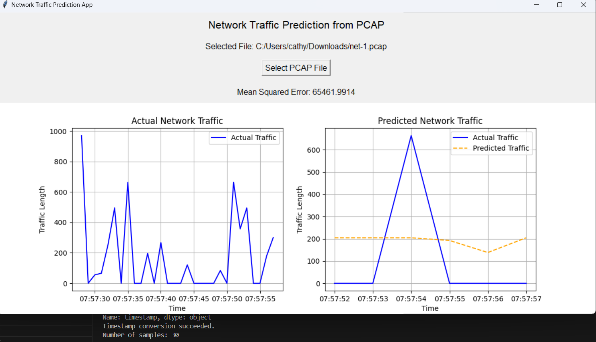

# Network Traffic Prediction 
This code predicts network traffic from PCAP files using machine learning, detects anomalies, and suggests capacity planning, all presented via a Tkinter-based GUI.

## How to run
```
pip install scapy pandas scikit-learn
python3 Network-pred-upload.py
python3 Network-pred-real-time-app.py
```

## Example
### Network traffic prediction using data captured through wireshark.


### Real time prediction.


## Steps of algorithm
1. File Selection and Processing
The user selects a PCAP file using the file dialog.
The selected PCAP file is loaded, and packet details such as timestamps and lengths are extracted.
2. Data Preprocessing
Timestamps are converted to a numerical format and then transformed into datetime objects.
The data is resampled into 1-second intervals, where the sum of the packet lengths is calculated for each interval.
A new feature previous_traffic is created, which is the value of the previous interval's traffic.
3. Train-Test Split
The dataset is split into features (previous_traffic) and target values (length).
A train-test split is performed, with 80% of the data used for training and 20% for testing.
4. Model Training
A LinearRegression model is trained using the training data (X_train, y_train).
The trained model predicts the traffic values (y_pred) for the test set.
5. Error Calculation
The Mean Squared Error (MSE) between actual and predicted traffic values is computed and displayed in the app.
6. Result Plotting
The actual vs. predicted traffic data is plotted using matplotlib and embedded into the Tkinter window.
7. Anomaly Detection
The model detects traffic anomalies by comparing actual vs. predicted values using a threshold. If the difference exceeds the threshold (30%), the traffic is flagged as an anomaly.
8. Capacity Planning
The maximum predicted traffic is used to suggest a capacity plan with a 20% buffer.
9. Network Resource Allocation
The average predicted traffic is calculated, and based on its value, the code suggests resource allocation levels: "Low," "Medium," or "High."


